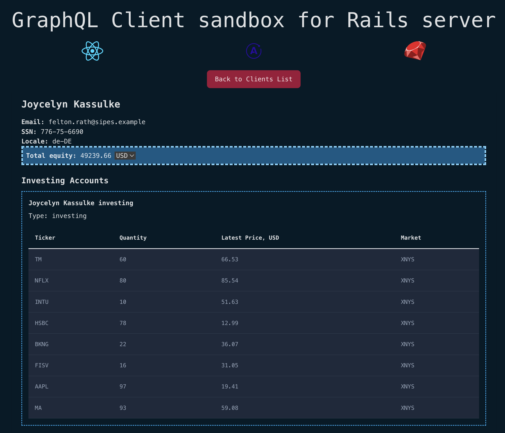

# React + Apollo + Tailwind client for Ruby on Rails graphql server
Server: https://github.com/lappi-lynx/rails7-graphql-sandbox

#### Usage
```
bun install
bun run dev
```

## Index page:

## Client profile page:

### TODO: Form for mutations and currency dropdown select for totalEquity field
